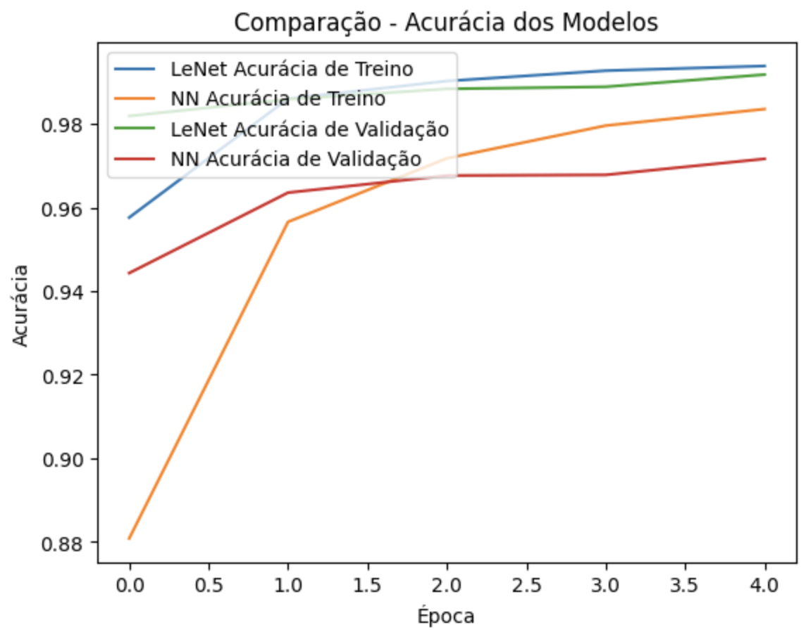

# ZENIST: Rede Neural - Lenet x Linear


Este repositório detalha um modelo de CNN (Convolutional Neural Network) com a arquitetura de Rede Neural Convolucional LENET5 treinado para detectar algarismos numéricos escritos manualmente do dataset MNIST, comparando-o com uma Rede Neural Linear. Além disso, é possível rodar uma interface gráfica com servidor em Flask para enviar uma imagem do algarismo numérico e receber o resultado predito. 

## Contexto 

O dataset MNIST é um dos mais utilizados para treinar e testar algoritmos de reconhecimento de dígitos manuscritos. Neste repositório implementamos uma CNN (Convolutional Neural Network) e uma NN Linear, comparando-as. 

### Notebook
O arquivo "neural_mnnsit.ipynb" é um notebook que pode ser executado no [Google Collab](https://colab.research.google.com/drive/1AXUNDPHe7zYVI3eHkJ8Xc5ig7vXvWoO7?usp=sharing). Ele detalha o tratamento dos dados, treinamento do modelo e comparação dos resultados. 

**Treinamento dos dados:**
Nessa seção instalamos as dependências e importamos o dataset, separando-o entre treino e teste, categorizando, normalizando-o e configurando o canal de cor.

**Rede Neural Convolucional - Lenet:** 
Aqui implementamos a arquitetura de Rede Neural Convolucional Lenet, composta pelas camadas de Convolução, Pooling e as totalmente conectadas.

```python
from keras.models import Sequential
from keras.layers import Dense, Conv2D, MaxPool2D, Flatten, Dropout

model = Sequential()
model.add(Conv2D(filters=32, kernel_size=(5,5), padding='same', activation='relu', input_shape=(28, 28, 1)))
model.add(MaxPool2D(strides=2))
model.add(Conv2D(filters=48, kernel_size=(5,5), padding='valid', activation='relu'))
model.add(MaxPool2D(strides=2))
model.add(Flatten())
model.add(Dense(256, activation='relu'))
model.add(Dense(84, activation='relu'))
model.add(Dense(10, activation='softmax'))

model.build()
model.summary()
```

Aqui está um resumo: 


**Rede Neural Linear:**
Diferente da convolucional, aqui apenas adicionamos as camadas totalmente conectadas.

```python
model_linear = Sequential([
    Dense(128, input_shape=(784,), activation='relu'),
    Dense(64, activation='sigmoid'),
    Dense(32, activation='sigmoid'),
    Dense(10, activation='softmax')
])

model_linear.build()
model_linear.summary()
```

Aqui está um resumo: 


**Comparação dos Modelos:** 
Comparando em termos de tempo de treinamento, desempenho e tempo de inferência. 

* **Tempo de treinamento**: a CNN possui um tempo de treinamento maior tendo em vista que suas camadas de convolução e pooling acabam extraindo mais features da imagem, com tempo médio de 1min20s por época nos treinamentos realizados (presente no Collab). Logo, em contrapartida, a NN linear é bem mais rápida, com tempo médio de 6 segundos por época. 
* **Desempenho**: a acurácia da CNN é superior, com resultados melhores, de novo, devido suas camadas que extraem melhores features. A NN linear acaba tendo um desempenho inferior, com uma acurácia menor e errando mais, mas ainda apresenta bons resultados. 

Segue um gráfico detalhando a diferença no desempenho dos dois. É nítido que a NN converge mais rápido por época, mas acaba tendo uma acurácia inferior.



O mesmo acontece com a sua perda. 


* **Tempo de inferência**: a NN linear acaba sendo mais rápida(67ms), já a CNN um pouco mais lenta (127ms). Ambos os dados podem ser observados no collab. A diferença é pouca, e a CNN acerta mais.

### Resultado geral:

| Modelo | Acurácia | Tempo de Treinamento | Desempenho |
|--------|----------|----------------------|--------------------------|
| CNN    | 99.39%    | 80s/epoch              | Alto      |
| LeNet  | 98.36%    |  6s/epoch           | Baixo        |

## Interface


* Modelo convolucional e linear treinado para detectar algarismos numéricos escritos manualmente e enviados;
* Backend que apresente duas rotas:
1. Uma rota que receba uma imagem de um algarismo e retorne o valor do algarismo. Não é necessário tratar os casos que nenhum foi encontrado, utilizar como referencia o modelo de aula;
2. Uma rota que exiba uma página HTML com um formulário para envio de uma imagem e exiba o valor do algarismo encontrado.

## Como Executar
Este repositório possui um ambiente virtual para executar a aplicação web. 

```bash
python3 -m venv venv
source venv/bin/activate
pip install -r requirements.txt
```
Rode o arquivo:
```bash
python3 app.py
```

## Diretório

```bash
CNN-MNIST/
├── models/ # Exportação do modelo desse projeto
│   ├── pesos_convolucional.h5
│   └── pesos_linear.h5
├── static/ # Arquivos estáticos da interface gráfica 
│   ├── uploads/ # Imagens enviadas pela interface gráfica
│   ├── background-sobre.jpg
│   └── logo.png
│   └── style.css
├── templates/ # Arquivos da interface gráfica 
│   ├── index.html
│   └── show_image.html
├── utils/ # Imagens do README
│   ├── acuracia_modelos.png
│   ├── perda_modelos.png
│   ├── summary_cnn.png
│   └── summary_nn.png
├── venv/ # Ambiente virtual após instalar
├── .gitignore
├── app.py # Servidor em Flask
├── imagem.jpg # Imagem teste de algarismo numérico
├── neural_mnist.ipynb # Collab 
├── README.md
└── requirements.txt # Requirements do Ambiente Virtual
```


